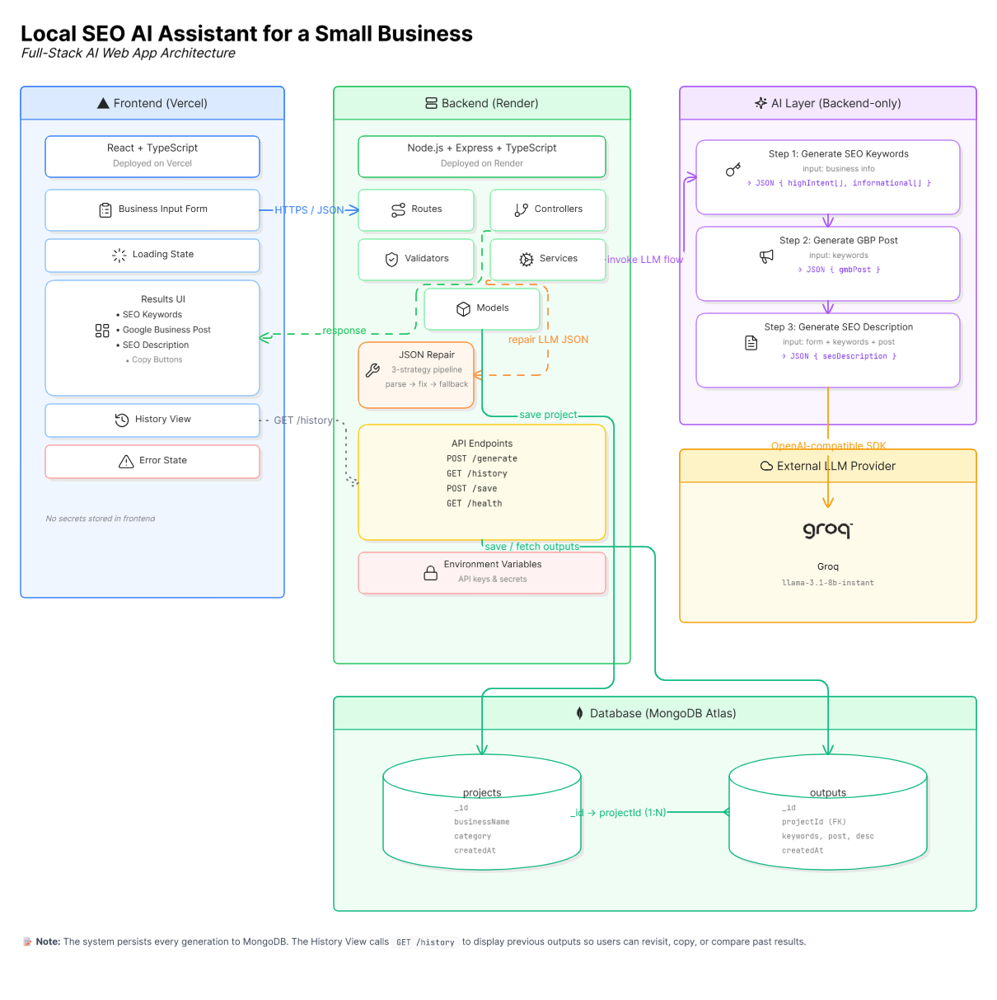
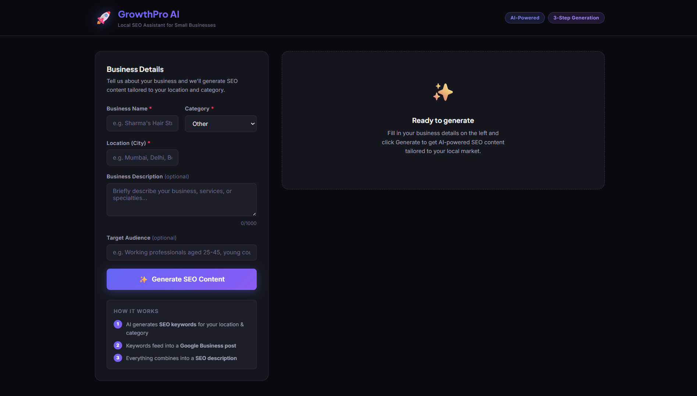
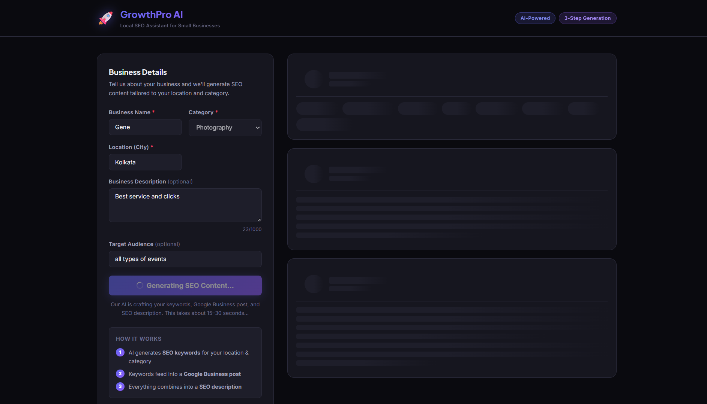
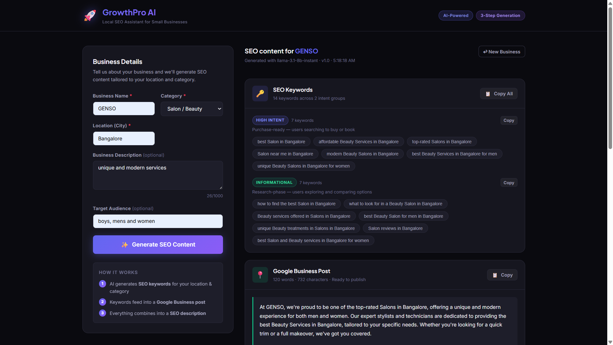
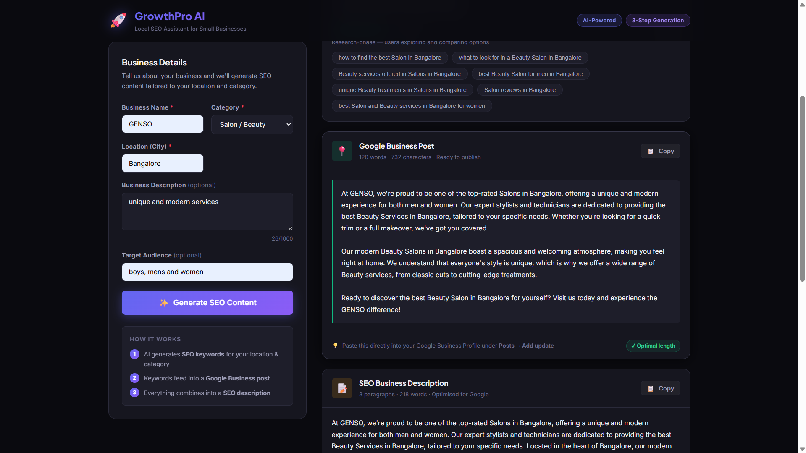
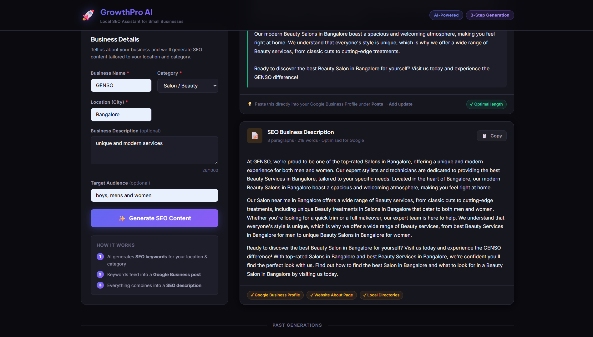
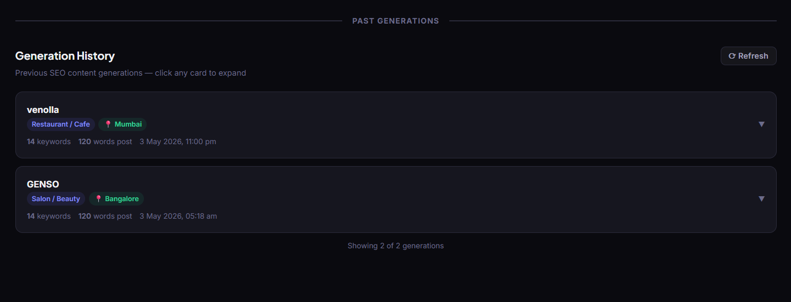
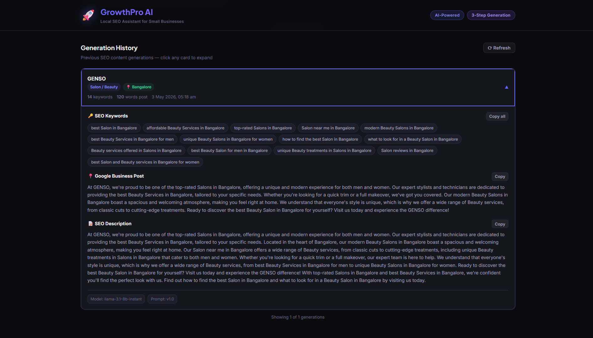

# 🚀 GrowthPro AI — Local SEO Assistant for Small Businesses

> AI-powered web app that helps local businesses generate **SEO keywords**, **Google Business posts**, and **SEO-friendly business descriptions** using a multi-step LLM chain.

[](https://vercel.com)
[](https://render.com)
[](https://mongodb.com/atlas)
[](https://groq.com)

---

## 🌐 Live Demo

| Layer | URL |
|-------|-----|
| **Frontend** | [https://local-seo-ai-assistant.vercel.app/](https://local-seo-ai-assistant.vercel.app/) |
| **Backend API** | [https://local-seo-ai-assistant.onrender.com](https://local-seo-ai-assistant.onrender.com) |
| **Health Check** | [https://local-seo-ai-assistant.onrender.com/health](https://local-seo-ai-assistant.onrender.com/health) |

> ⚠️ _Replace the above URLs with your actual deployed URLs._

---

## 🎥 Demo Video

📹 **[Watch the full demo walkthrough →](https://drive.google.com/file/d/10mCtic3GiEVJD2IINOqeSd3EygjosXtW/view?usp=sharing)**

_5-minute walkthrough covering: form submission, 3-step AI generation, result cards, copy-to-clipboard, history view, and error handling._

---

## 🏗️ Architecture Diagram



---

## 📸 Demo Screenshots

### Landing Page — Business Input Form


### Loading State — Skeleton Loaders


### Generated Results — SEO Keywords


### Generated Results — Google Business Post


### Generated Results — SEO Description


### Generation History — Expandable Cards


### History Card — Expanded Detail


---

## 🏛️ Architecture Decisions

### Why a 3-step LLM chain instead of a single prompt?

A single prompt asking for keywords + post + description produces generic, disconnected content. Our **3-step chain** ensures each output builds on the previous:

```
Step 1: Business info → SEO Keywords
Step 2: Keywords → Google Business Post (uses keywords naturally)
Step 3: All context → SEO Description (coherent with post + keywords)
```

This produces keyword-consistent, high-quality content where the GMB post and description naturally incorporate the same SEO keywords — exactly what Google rewards.

### Why Groq (Llama 3.1)?

Groq provides **free-tier** inference with extremely fast response times (~0.5–1 sec per step) using the `llama-3.1-8b-instant` model. It supports `response_format: { type: "json_object" }` natively, which guarantees structured JSON output from the LLM — critical for our 3-step chain where each step must parse the previous step's JSON.

> The codebase is designed to be provider-agnostic — the `PROVIDER_DEFAULTS` config in `llmService.ts` also includes entries for OpenAI and DeepSeek, so switching providers requires only changing `LLM_PROVIDER` and `LLM_API_KEY` in `.env`.

### Why separate `projects` and `outputs` collections?

- **1:N relationship** — one business can have multiple generations over time
- **Query efficiency** — history fetches sort by `outputs.createdAt` then populate the project
- **Data integrity** — business details stay immutable; regenerations create new outputs linked to the same or new project

### Why Zod for validation?

Zod provides runtime type checking that TypeScript alone cannot. Request bodies from the frontend are `unknown` at runtime — Zod validates them and returns typed, trimmed, safe data before any business logic executes.

### Frontend state management

React hooks (`useGenerate`, `useHistory`, `useToast`) provide all the state management needed. No Redux, no Context API overhead — the app is a single-page tool with simple data flow.

---

## 📝 Prompt Design & Examples

All prompts use `response_format: { type: "json_object" }` for guaranteed structured output.

### Step 1 — Keyword Generation

**System prompt:**
```
You are an expert local SEO strategist with 10+ years of experience
helping small businesses rank on Google. You produce precise,
location-specific keyword lists that drive real organic traffic.
```

**User prompt (example for a salon in Mumbai):**
```
Generate a comprehensive local SEO keyword list for:
Business Name: Sharma Hair Studio
Category: Salon / Beauty
Location: Mumbai
Target Audience: Working professionals aged 25-45

Rules:
- 5-8 HIGH INTENT keywords (purchase-ready)
- 5-7 INFORMATIONAL keywords (research-phase)
- Must be specific to Mumbai and the Salon / Beauty category

Return JSON: { "highIntent": [...], "informational": [...] }
```

**Example output:**
```json
{
  "highIntent": [
    "best salon in Mumbai",
    "hair treatment salon Mumbai",
    "affordable haircut Mumbai",
    "unisex salon near me Mumbai",
    "bridal makeup artist Mumbai"
  ],
  "informational": [
    "how to choose a salon in Mumbai",
    "hair care tips for humid weather",
    "what to look for in a hair stylist",
    "best hair treatments for damaged hair",
    "salon hygiene standards to check"
  ]
}
```

### Step 2 — Google Business Post

Uses Step 1 keywords as input. The prompt requires:
- 100–150 words
- Natural keyword integration (3–5 keywords woven in)
- Location mention
- Clear call-to-action

### Step 3 — SEO Description

Uses **all previous outputs** as context:
- Business info (from form)
- Keywords (from Step 1)
- GMB post (from Step 2)

The prompt produces a 2–3 paragraph description structured as:
1. **Intro** — business, specialty, location
2. **Services** — key offerings, unique selling points
3. **CTA** — customer-focused closing

---

## 📁 Project Structure

```
GrowthPro AI/
├── frontend/                    # React + TypeScript + Vite → Vercel
│   ├── src/
│   │   ├── components/          # BusinessForm, KeywordsSection, PostSection,
│   │   │                        # DescriptionSection, HistoryView, HistoryCard,
│   │   │                        # SkeletonLoader, Toast, EmptyState
│   │   ├── hooks/               # useGenerate, useHistory, useToast
│   │   ├── services/api.ts      # Axios client (reads VITE_API_BASE_URL)
│   │   ├── types/index.ts       # All shared TypeScript interfaces
│   │   ├── App.tsx              # Main layout + state orchestration
│   │   └── index.css            # Full design system (dark mode, animations)
│   ├── .env                     # VITE_API_BASE_URL
│   └── vercel.json              # SPA rewrites
│
├── backend/                     # Node.js + Express + TypeScript → Render
│   ├── src/
│   │   ├── controllers/         # generateController, historyController, saveController
│   │   ├── models/              # Project.ts, Output.ts (Mongoose schemas)
│   │   ├── routes/index.ts      # GET /health, POST /generate, GET /history, POST /save
│   │   ├── services/
│   │   │   ├── llmService.ts    # 3-step LLM chain (provider-agnostic)
│   │   │   └── dbService.ts     # MongoDB CRUD + paginated history
│   │   ├── validators/          # Zod schemas for request validation
│   │   ├── utils/jsonRepair.ts  # Defensive JSON parsing (3 fallback strategies)
│   │   └── index.ts             # Express server + CORS + error handling
│   └── .env                     # MONGODB_URI, LLM_PROVIDER, LLM_API_KEY
│
├── demo/                        # Screenshots + architecture diagram
├── render.yaml                  # Render deployment config
└── README.md
```

---

## 🔌 API Routes

| Method | Route | Description |
|--------|-------|-------------|
| `GET`  | `/health` | Health check for deployment monitoring |
| `POST` | `/generate` | Validate input → 3-step LLM chain → Save to DB → Return result |
| `GET`  | `/history?page=1&limit=10` | Paginated history (newest first, project + output) |
| `POST` | `/save` | Explicit save / regeneration |

### POST /generate — Request

```json
{
  "businessName": "Sharma Hair Studio",
  "category": "Salon / Beauty",
  "location": "Mumbai",
  "description": "Premium unisex salon specialising in hair treatments",
  "targetAudience": "Working professionals aged 25-45"
}
```

### POST /generate — Response

```json
{
  "success": true,
  "projectId": "665a1b2c3d4e5f6a7b8c9d0e",
  "outputId": "665a1b2c3d4e5f6a7b8c9d0f",
  "keywords": {
    "highIntent": ["best salon in Mumbai", "..."],
    "informational": ["how to choose a salon", "..."]
  },
  "gmbPost": "Looking for the best salon in Mumbai? ...",
  "seoDescription": "Sharma Hair Studio is a premium unisex salon ...",
  "modelName": "llama-3.1-8b-instant",
  "promptVersion": "v1.0"
}
```

---

## 🗄️ MongoDB Schema

**`projects` collection:**
```
_id, businessName, category, location, description?, targetAudience?,
createdAt, updatedAt
```

**`outputs` collection:**
```
_id, projectId (→ projects._id), keywords { highIntent[], informational[] },
gmbPost, seoDescription, promptVersion, modelName, createdAt, updatedAt
```

Relationship: `projects (1) → outputs (N)` — one business can have multiple generations.

---

## ⚙️ Environment Variables

### Backend (`backend/.env`)

| Variable | Description | Example |
|----------|-------------|---------|
| `PORT` | Server port | `5000` |
| `NODE_ENV` | Environment | `development` / `production` |
| `MONGODB_URI` | MongoDB Atlas connection string | `mongodb+srv://...` |
| `LLM_PROVIDER` | LLM provider | `groq` / `openai` / `deepseek` |
| `LLM_API_KEY` | API key for the chosen provider | `gsk_...` / `sk-...` |
| `CORS_ORIGIN` | Allowed frontend origin | `http://localhost:5173` |

### Frontend (`frontend/.env`)

| Variable | Description | Example |
|----------|-------------|---------|
| `VITE_API_BASE_URL` | Backend API base URL | `http://localhost:5000` |

---

## 🚀 Local Setup

### Prerequisites
- Node.js 18+
- MongoDB Atlas account (free tier)
- Groq API key (free at [console.groq.com](https://console.groq.com))

### 1. Clone & install

```bash
git clone <your-repo-url>
cd "GrowthPro AI"

cd backend && npm install
cd ../frontend && npm install
```

### 2. Configure environment

**Backend** — edit `backend/.env`:
```
MONGODB_URI=mongodb+srv://<user>:<pass>@<cluster>.mongodb.net/growthpro
LLM_PROVIDER=groq
LLM_API_KEY=gsk_your_key_here
CORS_ORIGIN=http://localhost:5173
```

**Frontend** — `frontend/.env` is pre-configured for local dev.

### 3. Run

```bash
# Terminal 1
cd backend && npm run dev

# Terminal 2
cd frontend && npm run dev
```

Open **http://localhost:5173**

---

## ☁️ Deployment

The application is deployed as follows:

| Component | Platform | Details |
|-----------|----------|---------|
| **Frontend** | [Vercel](https://vercel.com) | Root directory: `frontend/`, env var: `VITE_API_BASE_URL` → backend Render URL |
| **Backend** | [Render](https://render.com) | Root directory: `backend/`, build: `npm install && npm run build`, start: `npm run start` |
| **Database** | [MongoDB Atlas](https://mongodb.com/atlas) | Free M0 cluster, IP whitelist: `0.0.0.0/0` for Render access |

Backend env vars on Render: `MONGODB_URI`, `LLM_PROVIDER`, `LLM_API_KEY`, `CORS_ORIGIN` (Vercel URL), `NODE_ENV=production`.

---

## 🛠️ Tech Stack

| Layer | Technology |
|-------|-----------|
| Frontend | React 18, TypeScript, Vite |
| Styling | Vanilla CSS (custom dark-mode design system) |
| Backend | Node.js, Express, TypeScript |
| Validation | Zod (runtime request validation) |
| Database | MongoDB Atlas + Mongoose ODM |
| AI / LLM | Groq Llama 3.1 (OpenAI-compatible SDK) |
| Deployment | Vercel (FE) + Render (BE) |

---

## ✨ Features

- 🤖 **3-step AI chain** — keywords → GMB post → SEO description (each step builds on the last)
- 🎨 **Premium dark-mode UI** — glassmorphism, gradient accents, micro-animations
- 📋 **Click-to-copy** — copy individual keywords, entire sections, or full posts
- 🗂️ **Generation history** — paginated, expandable cards with full details
- ⏳ **Skeleton loaders** — animated placeholders while AI generates
- 🔔 **Toast notifications** — success/error feedback
- ✅ **Input validation** — Zod on backend, inline validation on frontend
- 🔄 **Provider-agnostic** — switch between Groq/OpenAI/DeepSeek with 2 env vars
- 📱 **Responsive** — works on desktop, tablet, and mobile
